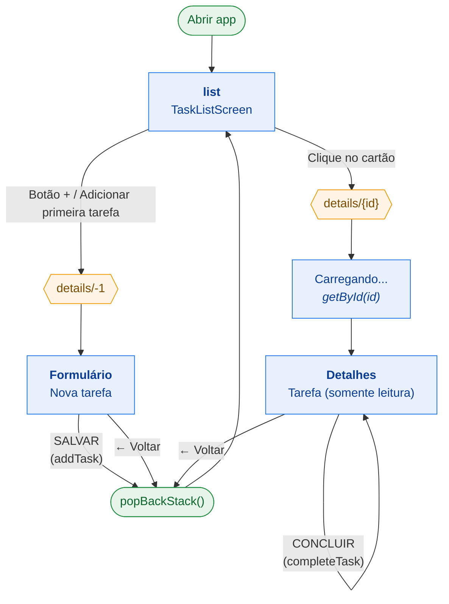

# UniDo

> Sua rotina acadêmica organizada.

O UniDo é um aplicativo Android nativo para gerenciar tarefas acadêmicas: cadastrar, listar, buscar, consultar, concluir e excluir. Foi desenvolvido como atividade final de **Android Intermediário**. Todos os dados ficam salvos localmente num banco SQLite (Room), então o app funciona sem internet.

---

## Sumário

- [Requisitos da atividade atendidos](#requisitos-da-atividade-atendidos)
- [Stack técnica](#stack-técnica)
- [Requisitos do ambiente](#requisitos-do-ambiente)
- [Instalação](#instalação)
- [Como rodar](#como-rodar)
- [Arquitetura](#arquitetura)
- [Estrutura de pastas](#estrutura-de-pastas)
- [Fluxos do aplicativo](#fluxos-do-aplicativo)
- [Modelo de dados](#modelo-de-dados)
- [Limitações conhecidas](#limitações-conhecidas)
- [Documentação complementar](#documentação-complementar)

---

## Requisitos da atividade atendidos

- [x] Kotlin
- [x] Jetpack Compose
- [x] Navigation Compose
- [x] Room Database (persistência local)
- [x] Arquitetura MVVM
- [x] Duas telas principais: lista e cadastro/detalhes
- [x] Cadastro, listagem, consulta, conclusão e exclusão de tarefas

---

## Stack técnica

| Categoria | Tecnologia | Versão |
|---|---|---|
| Linguagem | Kotlin | 2.0.21 |
| UI | Jetpack Compose (BOM) + Material 3 | 2024.12.01 |
| Navegação | Navigation Compose | 2.8.5 |
| Persistência | Room (runtime, ktx, compiler via KSP) | 2.6.1 |
| Estado / ciclo de vida | Lifecycle ViewModel + Coroutines / Flow | 2.8.7 |
| Processador de anotações | KSP | 2.0.21-1.0.28 |
| Build | Android Gradle Plugin / Gradle Wrapper | 8.7.3 / 9.3.0 |
| JVM de compilação | Java | 17 |

| Configuração Android | Valor |
|---|---|
| `applicationId` / `namespace` | `com.example.unido` |
| `minSdk` | 24 (Android 7.0) |
| `targetSdk` / `compileSdk` | 35 (Android 15) |
| `versionName` (`versionCode`) | 1.0 (1) |

Todas as versões de bibliotecas e plugins ficam centralizadas no *version catalog* `gradle/libs.versions.toml`.

---

## Requisitos do ambiente

- **JDK 17**. Confira com `java -version`. O Android Studio já traz um JDK embutido (JBR) que serve.
- **Android SDK** com:
  - SDK Platform **35**
  - Build-Tools (o AGP baixa automaticamente a versão necessária, se as licenças estiverem aceitas)
  - Platform-Tools (`adb`)
- **Android Studio** (recomendado) **ou** só a linha de comando com o SDK instalado.
- Um **emulador** (AVD) com API ≥ 24, **ou** um aparelho físico com a *Depuração USB* ativada.

---

## Instalação

### 1. Clonar o repositório

```bash
git clone <url-do-repositorio> UniDo
cd UniDo
```

### 2. Configurar o caminho do Android SDK

O arquivo `local.properties` **não é versionado**, porque cada máquina tem o seu. O Android Studio cria esse arquivo sozinho ao abrir o projeto. Para usar só a linha de comando, crie-o manualmente:

```properties
# Linux
sdk.dir=/home/<usuario>/Android/Sdk
# macOS
sdk.dir=/Users/<usuario>/Library/Android/sdk
# Windows (barras escapadas)
sdk.dir=C\:\\Users\\<usuario>\\AppData\\Local\\Android\\Sdk
```

Outra opção é exportar a variável `ANDROID_HOME` apontando para o SDK.

### 3. Aceitar as licenças do SDK (apenas na primeira vez, via CLI)

```bash
$ANDROID_HOME/cmdline-tools/latest/bin/sdkmanager --licenses
```

### 4. Sincronizar as dependências

- **Android Studio:** *File → Open* → selecione a pasta `UniDo` e espere o *Gradle Sync* terminar.
- **CLI:** o primeiro build baixa o Gradle 9.3.0 e todas as dependências:

```bash
./gradlew assembleDebug
```

> No Linux e no macOS, se aparecer `Permission denied`, rode `chmod +x gradlew`.
> No Windows, use `gradlew.bat` em vez de `./gradlew`.

---

## Como rodar

### Pelo Android Studio

1. Escolha um emulador ou aparelho na barra de dispositivos.
2. Selecione a configuração **app** e clique em **Run ▶** (`Shift+F10`).

### Pela linha de comando

```bash
# 1. Verifique se há um dispositivo conectado ou um emulador ligado
adb devices

# (opcional) liste e inicie um emulador
emulator -list-avds
emulator -avd <nome_do_avd> &

# 2. Compile e instale o APK de debug no dispositivo
./gradlew installDebug

# 3. Abra o app
adb shell am start -n com.example.unido/.MainActivity
```

### Gerar só o APK

```bash
./gradlew assembleDebug
# Saída: app/build/outputs/apk/debug/app-debug.apk

# Instalação manual do APK:
adb install -r app/build/outputs/apk/debug/app-debug.apk
```

> O build `release` **não tem configuração de assinatura** (`signingConfig`). Para distribuir o app, é preciso configurar uma keystore em `app/build.gradle.kts`.

### Outras tarefas úteis

| Comando | O que faz |
|---|---|
| `./gradlew clean` | Apaga a pasta `build/`. |
| `./gradlew lint` | Faz a análise estática. O relatório fica em `app/build/reports/`. |
| `./gradlew test` | Roda os testes unitários. O projeto ainda não tem testes. |
| `adb shell pm clear com.example.unido` | Apaga os dados do app, inclusive o banco `unido.db`. |

---

## Arquitetura

O app segue o padrão **MVVM** (*Model–View–ViewModel*), com **fluxo de dados unidirecional**: o estado desce do banco até a tela, e os eventos sobem da tela até o banco.

```
┌─────────────────────────────────────────────────────────────┐
│  VIEW (Jetpack Compose)                   ui/               │
│  TaskListScreen · TaskDetailsScreen · UniDoNavHost          │
└───────────▲─────────────────────────────────┬───────────────┘
            │ StateFlow<List<Task>>           │ eventos: addTask(),
            │ (collectAsState)                │ completeTask(), deleteTask()
┌───────────┴─────────────────────────────────▼───────────────┐
│  VIEWMODEL                                viewmodel/        │
│  TaskViewModel — estado + regras de apresentação            │
└───────────▲─────────────────────────────────┬───────────────┘
            │ Flow<List<Task>>                │ suspend fun
┌───────────┴─────────────────────────────────▼───────────────┐
│  REPOSITORY                               data/repository/  │
│  TaskRepository — ponto único de acesso aos dados           │
└───────────▲─────────────────────────────────┬───────────────┘
            │ Flow (emite a cada mudança)     │ INSERT/UPDATE/DELETE
┌───────────┴─────────────────────────────────▼───────────────┐
│  MODEL / PERSISTÊNCIA (Room + SQLite)     data/local/       │
│  Task (@Entity) · TaskDao (@Dao) · TaskDatabase → unido.db  │
└─────────────────────────────────────────────────────────────┘
```

**Decisões técnicas:**

- **Atualização reativa da tela:** `TaskDao.getAllTasks()` retorna um `Flow`. O Room emite uma lista nova a cada alteração na tabela, e as telas nunca pedem para "recarregar". O ViewModel converte esse `Flow` em `StateFlow` com `stateIn(viewModelScope, WhileSubscribed(5_000), emptyList())`. Com isso, o banco só é observado enquanto há tela coletando, e a observação continua durante rotações de tela.
- **Injeção manual de dependências:** a `UniDoApplication` cria o `TaskRepository` com `by lazy`, e a `MainActivity` o entrega ao ViewModel através de uma `ViewModelProvider.Factory`. O projeto não usa Hilt ou Koin, para não aumentar o escopo.
- **Banco singleton:** `TaskDatabase.getInstance()` usa *double-checked locking* (`@Volatile` + `synchronized`), garantindo uma única conexão com o banco no processo.
- **Concorrência:** as operações de escrita são `suspend` e rodam em `viewModelScope.launch`. O Room as executa fora da *main thread*.
- **ViewModel compartilhado:** um único `TaskViewModel`, no escopo da `MainActivity`, atende as duas telas.
- **Activity única:** existe só uma `Activity`. As "telas" são destinos *composable* do `NavHost`.

---

## Estrutura de pastas

```
UniDo/
├── build.gradle.kts              # Build raiz: declara os plugins (apply false)
├── settings.gradle.kts           # Nome do projeto, módulos (:app) e repositórios Maven
├── gradle.properties             # Flags do Gradle/AndroidX (memória da JVM, nonTransitiveRClass…)
├── gradle/
│   ├── libs.versions.toml        # Version catalog: versões, bibliotecas e plugins
│   └── wrapper/                  # Gradle Wrapper (fixa a versão 9.3.0 do Gradle)
├── gradlew / gradlew.bat         # Scripts do wrapper (Unix / Windows)
├── local.properties              # (não versionado) caminho do Android SDK
├── docs/
│   └── FUNCIONAMENTO.md          # Explicação detalhada de cada função
└── app/                          # Módulo único do aplicativo
    ├── build.gradle.kts          # SDKs, Java 17, Compose, dependências
    └── src/main/
        ├── AndroidManifest.xml   # Registra UniDoApplication e MainActivity (LAUNCHER)
        ├── res/
        │   ├── drawable/         # ic_unido_logo.xml (logo vetorial)
        │   └── values/           # colors.xml e themes.xml (tema nativo Theme.UniDo)
        └── java/com/example/unido/
            ├── UniDoApplication.kt
            ├── MainActivity.kt
            ├── data/
            │   ├── local/
            │   │   ├── Task.kt
            │   │   ├── TaskDao.kt
            │   │   └── TaskDatabase.kt
            │   └── repository/
            │       └── TaskRepository.kt
            ├── viewmodel/
            │   └── TaskViewModel.kt
            └── ui/
                ├── navigation/
                │   └── UniDoNavHost.kt
                ├── theme/
                │   └── Theme.kt
                ├── list/
                │   └── TaskListScreen.kt
                └── details/
                    └── TaskDetailsScreen.kt
```

### O que cada pasta faz

#### Raiz (`com.example.unido`)
Ponto de entrada do processo e da interface.
- **`UniDoApplication.kt`**: subclasse de `Application`, criada antes de qualquer tela. Funciona como o *container* de dependências e expõe o `repository` (criado sob demanda).
- **`MainActivity.kt`**: a única `Activity`. Ativa o modo *edge-to-edge*, cria o `TaskViewModel` com a factory e monta a interface: `UniDoTheme { UniDoNavHost(viewModel) }`.

#### `data/`
É a camada de dados. Não conhece nada da interface.

- **`data/local/`**: persistência local com Room.
  - `Task.kt`: `@Entity` que representa uma tarefa. Mapeia para a tabela `Tarefa`. Os nomes das colunas continuam em português para manter compatível o banco das instalações antigas.
  - `TaskDao.kt`: interface `@Dao` com as consultas `getAllTasks()` (reativa, com `Flow`), `getById()`, `insert()`, `update()` e `delete()`. O KSP gera a implementação durante a compilação.
  - `TaskDatabase.kt`: `@Database` (versão 1), singleton que abre o arquivo `unido.db`.
- **`data/repository/`**: abstração sobre as fontes de dados.
  - `TaskRepository.kt`: repassa as chamadas ao DAO. É aqui que outra fonte de dados (uma API, por exemplo) entraria sem que o ViewModel precisasse mudar.

#### `viewmodel/`
É a camada de apresentação. Guarda o estado e a lógica, mas não desenha nada.
- **`TaskViewModel.kt`**: expõe `tasks: StateFlow<List<Task>>` e as ações `addTask()` (valida o título, remove espaços e aplica valores padrão), `completeTask()`, `deleteTask()` e `getById()`. Também contém a `factory` que injeta o repositório.

#### `ui/`
É a camada de interface, só com Jetpack Compose. As telas não acessam dados diretamente: tudo passa pelo ViewModel.
- **`ui/navigation/`**: `UniDoNavHost.kt` declara o grafo de navegação e o objeto `Routes` (`"list"` e `"details/{id}"`, onde `id = -1` significa "nova tarefa").
- **`ui/theme/`**: `Theme.kt` define o `UniDoTheme` (Material 3 + `Surface`). É o lugar para personalizar cores e tipografia.
- **`ui/list/`**: `TaskListScreen.kt` é a tela inicial, com cabeçalho, busca por título ou disciplina, uma `LazyColumn` de `TaskCard` (checkbox para concluir e lixeira para excluir) e o estado vazio.
- **`ui/details/`**: `TaskDetailsScreen.kt` é uma tela com dois modos: **formulário** de nova tarefa (`taskId <= 0`) ou **visualização** somente leitura de uma tarefa existente, com o botão *CONCLUIR*.

#### `res/`
São os recursos nativos do Android.
- `drawable/ic_unido_logo.xml`: o logo, em vetor.
- `values/themes.xml`: o tema `Theme.UniDo`, aplicado à activity antes do Compose assumir a tela. Define as barras de status e de navegação brancas com ícones escuros.
- `values/colors.xml`: as cores básicas.

---

## Fluxos do aplicativo

### Navegação



### Etapas de cada operação

#### 1. Inicialização do app
1. O Android cria a `UniDoApplication`.
2. A `MainActivity.onCreate()` busca o `repository`. No primeiro acesso, isso cria o `TaskDatabase` e o `TaskRepository`.
3. `setContent` cria o `TaskViewModel` através da `factory`.
4. O `UniDoNavHost` abre a rota `"list"`.
5. A `TaskListScreen` coleta `viewModel.tasks` e o Room faz o primeiro `SELECT`.
6. A lista é desenhada, ou aparece o estado vazio "Nenhuma tarefa cadastrada.".

#### 2. Criar uma tarefa
1. Na lista, o usuário toca em **+** e o app navega para `details/-1`.
2. A `TaskDetailsScreen` entra no modo formulário: Título, Disciplina, Data e hora, Descrição.
3. O botão **SALVAR** só fica habilitado quando o título não está vazio.
4. Ao salvar, o app chama `viewModel.addTask(...)`, que:
   - remove os espaços das pontas dos campos (`trim`);
   - aplica valores padrão (`"Sem disciplina"`, `"Data não informada"`, `"Sem descrição"`);
   - define `createdBy = "Criado pelo aluno"`;
   - chama `repository.insert()`, que executa `INSERT` no SQLite.
5. `onBack()` faz `popBackStack()` e o usuário volta para a lista.
6. O `Flow` do Room emite a lista nova e a tarefa aparece no topo (`ORDER BY id DESC`).

#### 3. Consultar uma tarefa
1. O usuário toca num cartão, e o app navega para `details/{id}`.
2. O `LaunchedEffect(taskId)` chama `viewModel.getById(id)`, que executa um `SELECT ... WHERE id = :id`.
3. Enquanto a tarefa carrega, aparece "Carregando...". Depois, a tela mostra o status, título, disciplina, autor, prazo e descrição.

#### 4. Concluir uma tarefa
1. O usuário marca o **checkbox** na lista ou toca em **CONCLUIR** na tela de detalhes.
2. O app chama `viewModel.completeTask(task)`, que executa `repository.update(task.copy(completed = true))`, ou seja, um `UPDATE`.
3. O `Flow` emite a lista nova e o cartão passa a mostrar "CONCLUÍDA".

#### 5. Excluir uma tarefa
1. O usuário toca na **lixeira** do cartão.
2. O app chama `viewModel.deleteTask(task)`, que executa `repository.delete()`, ou seja, um `DELETE`, sem confirmação.
3. O `Flow` emite a lista nova e o cartão some.

#### 6. Buscar
1. O usuário digita no campo de texto da lista, e o estado `searchQuery` muda.
2. `filteredTasks` é recalculada na memória: mantém as tarefas cujo `title` ou `subject` contêm o texto, sem diferenciar maiúsculas de minúsculas.
3. A `LazyColumn` é redesenhada. Não há consulta nova ao banco.

---

## Modelo de dados

Banco: `unido.db`, versão 1. Tabela: **`Tarefa`**.

| Propriedade Kotlin | Coluna SQLite | Tipo | Regra |
|---|---|---|---|
| `id` | `id` | `INTEGER` PK | Autoincremento (`autoGenerate = true`) |
| `title` | `titulo` | `TEXT` | Obrigatório (validado na UI e no ViewModel) |
| `subject` | `disciplina` | `TEXT` | Padrão: `"Sem disciplina"` |
| `createdBy` | `criadoPor` | `TEXT` | Sempre `"Criado pelo aluno"` |
| `dateTime` | `dataHora` | `TEXT` | Texto livre. Padrão: `"Data não informada"` |
| `description` | `descricao` | `TEXT` | Padrão: `"Sem descrição"` |
| `completed` | `concluida` | `INTEGER` (0/1) | Padrão: `false` |

> Qualquer mudança nesse esquema exige aumentar o `version` do `@Database` e criar uma `Migration`. Sem isso, o app quebra em quem já tem o banco instalado.

---

## Limitações conhecidas

- Depois de tocar em **CONCLUIR** na tela de detalhes, a tela só mostra o novo status quando o usuário sai e volta, porque a tarefa é carregada uma única vez.
- Não é possível editar uma tarefa existente nem desmarcar uma tarefa concluída.
- A exclusão não pede confirmação.
- O botão de filtro da lista é apenas visual. A filtragem é feita pelo campo de texto.
- A data e a hora são texto livre, sem validação nem ordenação por prazo.
- O projeto ainda não tem testes automatizados.

---

## Documentação complementar

- [`docs/FUNCIONAMENTO.md`](docs/FUNCIONAMENTO.md): explicação detalhada de **cada classe e função** do app.
